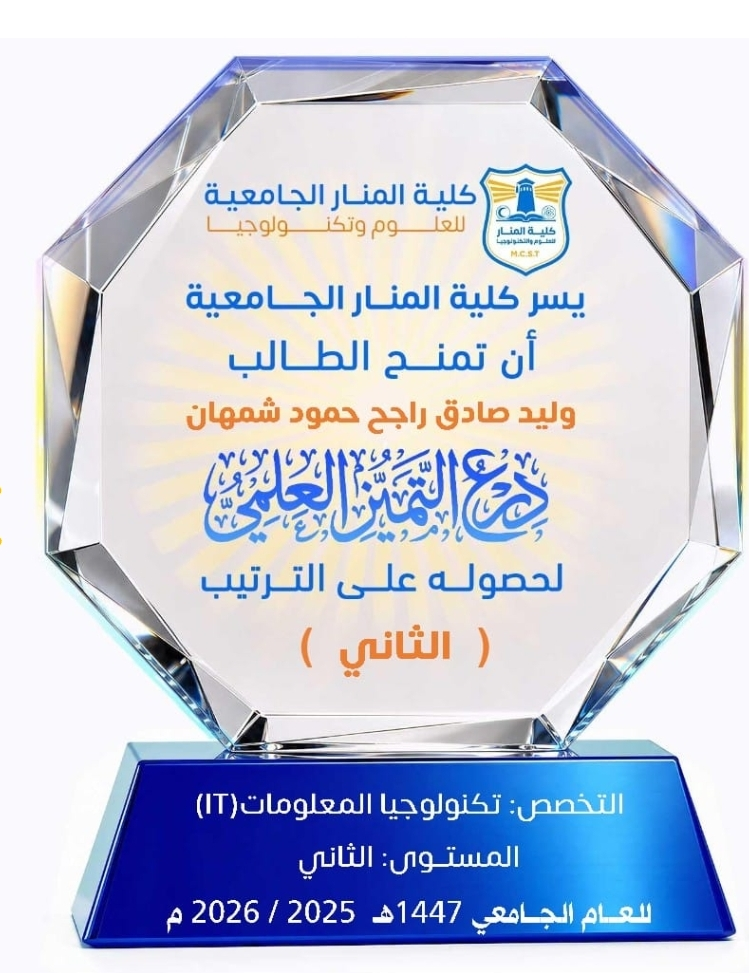
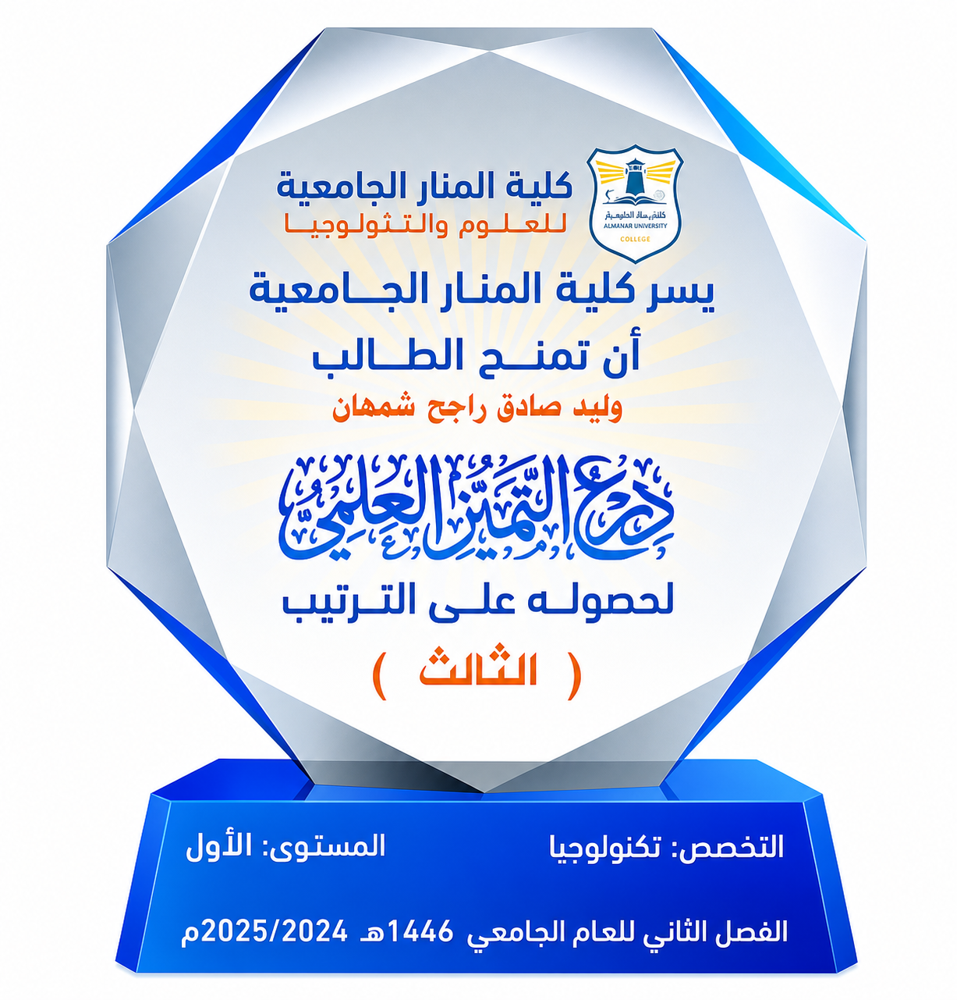

  

  

  
  
  

---

## 👨‍💻 About Me | نبذة عني

I'm a passionate <b>IT student</b> focused on <b>programming</b> and <b>databases</b>, with hands-on experience building real projects in <b>C#</b>, <b>SQL</b>, <b>Python</b> and modern web technologies. I also build AI tools and explore cybersecurity.
  
طالب شغوف في <b>تكنولوجيا المعلومات</b>، أركز على <b>البرمجة</b> و<b>قواعد البيانات</b>، ولدي خبرة عملية في بناء مشاريع حقيقية باستخدام <b>C#</b> و<b>SQL</b> و<b>Python</b> وتقنيات الويب الحديثة، بالإضافة إلى تطوير أدوات الذكاء الاصطناعي واستكشاف الأمن السيبراني.

---

## 🏆 Academic Excellence | التميز الأكاديمي

  
  

  <table style="border: none; border-collapse: collapse;">
    <tr>
      <td align="center" style="padding: 20px;">
         
        <b>🥈 2nd Place</b> 
        Level 2 | 2025 / 2026 — المستوى الثاني
      </td>
      <td align="center" style="padding: 20px;">
         
        <b>🥉 3rd Place</b> 
        Level 1 | 2024 / 2025 — المستوى الأول
      </td>
    </tr>
  </table>

---

## 🎓 Certifications | الشهادات (Cisco Networking Academy)

<table align="center">
  <tr>
    <td align="center" width="250">
       
      <b>Introduction to Modern AI</b> 
      Cisco 
      
    </td>
    <td align="center" width="250">
       
      <b>Learn-A-Thon 2026</b> 
      Cisco 
      
    </td>
    <td align="center" width="250">
       
      <b>IT Customer Support Basics</b> 
      Cisco 
      
    </td>
  </tr>
</table>

---

## 🛠️ Tech Stack | المهارات التقنية

### Programming Languages | لغات البرمجة

### Databases | قواعد البيانات

### Tools | أدوات التطوير

### Operating Systems | أنظمة التشغيل

---

## 🚀 Featured Projects | أبرز المشاريع

<table align="center">
  <tr>
    <th>📁 Project | المشروع</th>
    <th>📝 Description | الوصف</th>
    <th>⚡ Tech | التقنيات</th>
    <th>⭐ Stars</th>
  </tr>
  <tr>
    <td align="center">
      <a href="https://github.com/waleedshamhan2050-sys/FaceTracker-Pro"><b>FaceTracker Pro</b></a>
    </td>
    <td>Advanced OSINT tool to find social media accounts using facial recognition أداة متقدمة للبحث عن حسابات التواصل الاجتماعي بالتعرف على الوجوه</td>
    <td align="center">
      
    </td>
    <td align="center">
      
    </td>
  </tr>
  <tr>
    <td align="center">
      <a href="https://github.com/waleedshamhan2050-sys/system-prompts-and-models-of-ai-tools"><b>System Prompts & AI Tools</b></a>
    </td>
    <td>A comprehensive collection of system prompts from 30+ AI tools مجموعة شاملة من التعليمات الداخلية لأدوات الذكاء الاصطناعي</td>
    <td align="center">
      
    </td>
    <td align="center">
      
    </td>
  </tr>
  <tr>
    <td align="center">
      <a href="https://github.com/waleedshamhan2050-sys/AI-Post-Generator"><b>AI Post Generator</b></a>
    </td>
    <td>AI-powered post generator for WhatsApp & Telegram channels مولد منشورات ذكي لقنوات واتساب وتيليجرام</td>
    <td align="center">
      
    </td>
    <td align="center">
      
    </td>
  </tr>
  <tr>
    <td align="center">
      <a href="https://github.com/waleedshamhan2050-sys/it-service-management-pro"><b>IT Service Management Pro</b></a>
    </td>
    <td>Professional IT service management system نظام إدارة خدمات تقنية المعلومات الاحترافي</td>
    <td align="center">
      
    </td>
    <td align="center">
      
    </td>
  </tr>
  <tr>
    <td align="center">
      <a href="https://github.com/waleedshamhan2050-sys/it-equipment-management"><b>IT Equipment Management</b></a>
    </td>
    <td>IT equipment tracking & management system نظام إدارة وتتبع المعدات التقنية</td>
    <td align="center">
      
    </td>
    <td align="center">
      
    </td>
  </tr>
  <tr>
    <td align="center">
      <a href="https://github.com/waleedshamhan2050-sys/yemen-ecommerce-platform"><b>Yemen E-Commerce Platform</b></a>
    </td>
    <td>Yemeni e-commerce platform منصة تجارة إلكترونية يمنية</td>
    <td align="center">
      
    </td>
    <td align="center">
      
    </td>
  </tr>
</table>

---

## 🎯 Current Goals | الأهداف الحالية

  
  
  
  

| Goal | الهدف | Description | الوصف | Status | الحالة |
|------|-------|-------------|-------|--------|--------|
| 🤖 AI | الذكاء الاصطناعي | Building skills in AI and its applications | تطوير مهاراتي في الذكاء الاصطناعي وتطبيقاته | 🟡 Learning |
| 🌐 Full Stack | الويب الكامل | Mastering full-stack web development | إتقان تطوير الويب الكامل | 🟡 Learning |
| 🔒 Cybersecurity | الأمن السيبراني | Going deeper into cybersecurity | التعمق في الأمن السيبراني | 🟡 Learning |
| 📦 Open Source | مفتوح المصدر | Building open-source projects for the community | بناء مشاريع مفتوحة المصدر تفيد المجتمع | 🟢 Ongoing |

---

## 📫 Connect With Me | تواصل معي

  
  
  
  
  
  
  

---

## 📊 GitHub Stats | إحصائيات GitHub

  

  

  

---

  

  🚀 Crafted by <a href="https://github.com/waleedshamhan2050-sys">Waleed Shamhan</a> | Last updated: 2026

